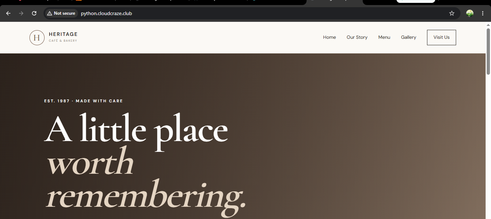

# ☕ Cafe Heritage

A simple and elegant **Python Flask-based café website** designed for deployment on an **AWS EC2 instance using Nginx, Gunicorn, and a subdomain**.

The project contains four pages: **Home, About, Services, and Contact**.

---

## 📌 Project Overview

**Cafe Heritage** is a lightweight web application created using Python Flask. It demonstrates how a Python web application can be deployed on an AWS EC2 server and accessed through a custom subdomain.

### Project Architecture

```text
User
  ↓
Subdomain
  ↓
Nginx
  ↓
Gunicorn
  ↓
Flask Application
  ↓
HTML / CSS / JavaScript
```

---

## 🎨 Frontend

The frontend is developed using:

- HTML5
- CSS3
- JavaScript
- Responsive design
- Flask Jinja2 templates

### Pages

1. Home
2. About
3. Services
4. Contact

The frontend files are located inside:

```text
templates/
static/
```

---

## ⚙️ Backend

The backend is developed using:

- Python
- Flask
- Gunicorn

Flask handles:

- URL routing
- Page rendering
- Backend application logic
- Serving dynamic templates

The main backend file is:

```text
app.py
```

The application runs internally on:

```text
127.0.0.1:5000
```

Gunicorn is used as the production WSGI server.

---

## ✨ Features

- Clean and responsive café website
- Four simple pages
- Flask-based backend
- Dynamic routing using Flask
- Responsive navigation
- Contact form interface
- Modern CSS design
- Easy to run locally
- Easy to deploy on AWS EC2
- Gunicorn production server
- Nginx reverse proxy
- Custom subdomain support
- Suitable for hosting alongside other websites on the same EC2 instance

---

## 📋 Prerequisites

Before running the project, make sure you have:

- Python 3
- pip
- Git
- AWS account
- AWS EC2 instance
- Nginx
- Domain name
- Access to DNS management

For deployment, the EC2 Security Group should allow:

```text
SSH     → 22
HTTP    → 80
HTTPS   → 443
```

Port `5000` does **not** need to be publicly exposed because Gunicorn will listen only on localhost.

---

## 🚀 Future Enhancements

The current project is intentionally simple. Possible future improvements include:

- Database integration
- Online table reservation
- User authentication
- Admin dashboard
- Real contact form backend
- Café menu management
- Online ordering
- Payment integration
- HTTPS using SSL/TLS
- Docker deployment
- CI/CD pipeline

---

## ☁️ Deployment on AWS EC2

The following steps describe how the Cafe Heritage project is deployed on an AWS EC2 instance using **Nginx + Gunicorn + Flask**.

---

## 1. Launch an AWS EC2 Instance

Go to the AWS Management Console and open:

```text
EC2 → Instances → Launch Instance
```

Select an appropriate Amazon Linux AMI.

Configure the instance according to your requirements.

### Security Group

Allow:

```text
SSH   → TCP 22
HTTP  → TCP 80
HTTPS → TCP 443
```

Connect to the EC2 instance using SSH.

Example:

```bash
ssh -i your-key.pem ec2-user@YOUR_PUBLIC_IP
```

---

## 2. Install Nginx and Git

Update the packages:

```bash
sudo dnf update -y
```

Install Nginx and Git:

```bash
sudo dnf install nginx git -y
```

Check the installations:

```bash
nginx -v
git --version
```

---

## 3. Start Nginx

Start the Nginx service:

```bash
sudo systemctl start nginx
```


---

## 4. Enable Nginx

Enable Nginx so that it automatically starts whenever the EC2 instance is restarted:

```bash
sudo systemctl enable nginx
```


---

## 5. Clone the GitHub Repository

Move to the application directory:

```bash
cd /var/www
```

Clone the GitHub repository:

```bash
sudo git clone YOUR_GITHUB_REPOSITORY_URL cafe-heritage
```

Change ownership:

```bash
sudo chown -R ec2-user:ec2-user /var/www/cafe-heritage
```

Move into the project:

```bash
cd /var/www/cafe-heritage
```

---

## 6. Create a Python Virtual Environment

Create the virtual environment:

```bash
python3 -m venv venv
```

This creates an isolated Python environment inside the project.

Project structure will now contain:

```text
cafe-heritage/
├── venv/
├── app.py
├── requirements.txt
├── templates/
└── static/
```

---

## 7. Activate the Virtual Environment

Run:

```bash
source venv/bin/activate
```


---

## 8. Install Requirements


```

Install the project dependencies:

```bash
pip install -r requirements.txt
```

The `requirements.txt` file contains the required Python packages such as:

```text
Flask
Gunicorn
```

---

## 9. Run the Application Using Gunicorn

Test the Flask application using Gunicorn:

```bash
gunicorn --bind 127.0.0.1:5000 app:app
```


---

## 🌐 10. Configure the Subdomain

Instead of accessing the website using the EC2 public IP, a subdomain is used.

For example:

```text
python.cloudcraze.club
```

Go to your domain provider's DNS management section.

Create a DNS record.

### CNAME Record

For example:

```text
Type: CNAME
Name: python
Value: cloudcraze.club
```

This creates:

```text
python.cloudcraze.club
```

> If your DNS provider requires the subdomain to point directly to the EC2 public IP, use an **A record** instead. CNAME records point to another hostname, not directly to an IP address.

---

## 11. Configure Nginx

Create a separate Nginx configuration file for the Python project:

```bash
sudo nano /etc/nginx/conf.d/python.config
```

Add:

```nginx
server {
    listen 80;

    server_name python.yourdomain.com;

    location / {
        proxy_pass http://127.0.0.1:5000;

        proxy_set_header Host $host;
        proxy_set_header X-Real-IP $remote_addr;
        proxy_set_header X-Forwarded-For $proxy_add_x_forwarded_for;
        proxy_set_header X-Forwarded-Proto $scheme;
    }
}
```

Replace:

```text
python.cloudcraze.club
```

with your actual Python subdomain.

For example:

```nginx
server_name python.cloudcraze.club;
```

---


## 12. Reload Nginx

After the configuration test succeeds:

```bash
sudo systemctl reload nginx
```


Open the subdomain in a browser:

```text
http://python.cloudcraze.club
```

---


## 📁 Final Project Structure

```text
cafe-heritage/
│
├── app.py
├── requirements.txt
├── README.md
├── .gitignore
│
├── templates/
│   ├── base.html
│   ├── index.html
│   ├── about.html
│   ├── services.html
│   └── contact.html
│
└── static/
    ├── css/
    │   └── style.css
    │
    └── js/
        └── script.js
```

---

# Output

